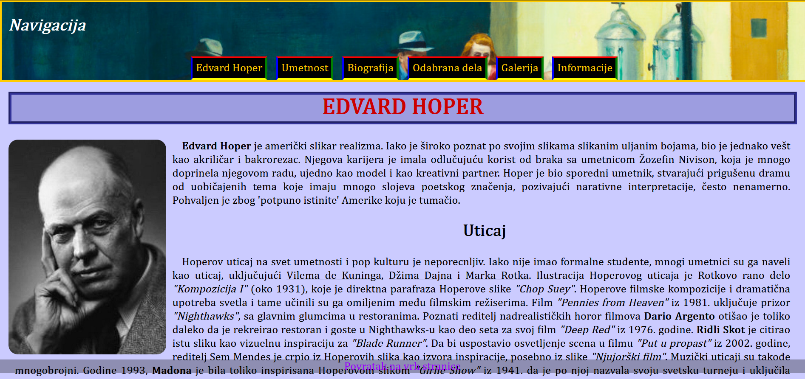

# Edward Hopper Website

## Description
This is a simple static website dedicated to the painter Edward Hopper.  
It was created as a web design project to practice basic front-end technologies.  
The site contains multiple HTML pages, a CSS stylesheet for design, a JavaScript file for simple interactivity, and images of Hopper’s works.

## Features
- Multiple HTML pages about Edward Hopper and his works
- Responsive design using CSS
- Basic JavaScript for interactivity
- Gallery page that uses an iframe to display additional content
- A simple form in *informacije.html* with a success page (*uspeh.html*)

## Technologies
- HTML5
- CSS3
- JavaScript (Vanilla)

## File Structure

```
hopper-website/
├─ eh.html              # homepage
├─ umetnost.html
├─ biografija.html
├─ odabranaDela.html
├─ galerija.html
├─ informacije.html
├─ uspeh.html           # success page for form submission
├─ ugljen.html
├─ bakropisi.html
├─ vodeneboje.html
├─ ulje.html
├─ svetionici.html
├─ prozori.html
├─ ljudi.html
├─ teatar.html
├─ css/
│   └─ style.css
├─ js/
│   └─ script.js
└─ images/
    └─ (artworks, photos used in the site)
```

## How to Run
1. Clone the repository:

   ```
   git clone https://github.com/nadjabozic/hopper-website.git
   ```

2. Open `eh.html` in your web browser.

## Deployment
This project can be deployed using [GitHub Pages](https://pages.github.com/) for free hosting.

## Preview



## Live Demo
👉 [View Website](https://nadjabozic.github.io/hopper-website/)
